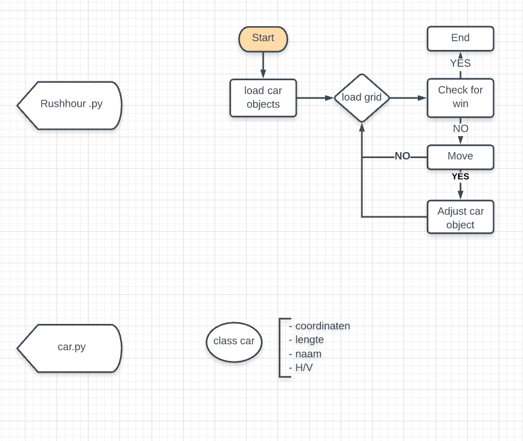

# Proces Commit4life
#### Programmeertheorie Paloma, Bart en Floor

##### Planning

week 1 - interpratie van de case
	wat is mijn case?
	welk (sub)probleem moet ik oplossen? Wat is de oplossing en hoe ziet tie eruit?
	hoe kan ik die (digitaal) presenteren? -> datastructuur
	hoe genereeer ik random een oplossing

week 2 - eerste resultaten
	random is af. resultaten laten zien
	hoe generee ik betere oplossingen dan random?
	waarom zou dit beter zijn

week 3 - exploratie resultaten en verfijning
	vergelijk je nieuwe manier(en) van oplossingen maken met random

week 4 - slotstuk

##### Process
###### maandag 06-01-20
	Github opstarten:
		3 branches
		floor is master
		2 forks van bart en paloma
		> gebruiken alleen de masterbranch op aanraden van Quinten

	Start programmeren
		- Simpele versie voor uitlezen autos van CSV
		- simpele grid versie op autos te laten zien
		- Randen rond spelbord aangebracht

	Probleem omschrijving
		rush hour
		creëer grid met blokjes (auto's) die kunnen schuiven in de juiste richting
		bedenk een algoritme wat een rush hour bord kan oplossen (de rode auto naar de uitgang leiden zonder te botsen)

		oplossing: start bij de auto wat de uitgang blokkeert, check elke auto die vanaf dan de mogelijkheid tot het verschuiven blokkeert
					zoveel mogelijk blokjes verschuiven tot het rode autootje stappen naar rechts kan zetten om uiteindelijk de uitgang te vinden
		repo weergeven op de manier van classes zoals bij adventure

	Complicaties:
		het rode blokje moet soms terug

###### dinsdag 07-01-20
	Bart werkt aan load grid
	Paloma werkt aan load cars
	Floor werkt aan objects voor load cars car.py
	
	
	Niet vergeten:
		'data' ipv 'games'
		
	Vragen voor presentatiesessie:
		voortgangsgesprek tijdens college
		waar is het college?

###### woensdag 08-01-20
	vragen voor vragen:
		
		
	Verbeterpunten:
		Onnodig power verbruiken tijdens het itereren
		+2 / +12 stappen 
		
